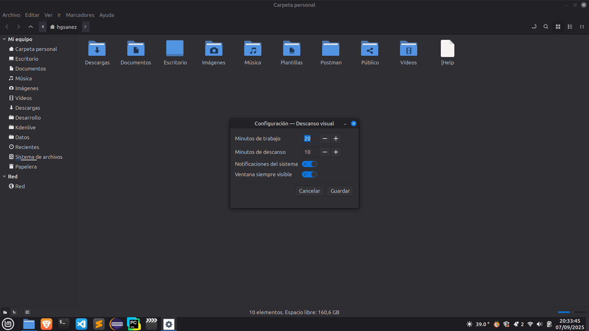
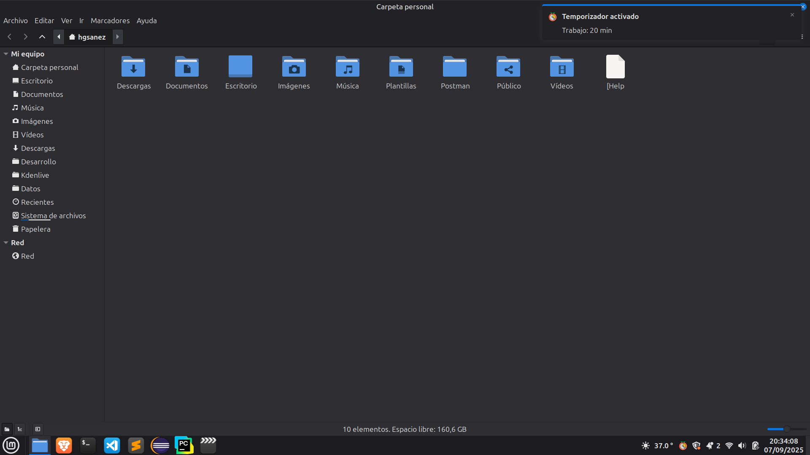

# Pomodoro App 🍅
Simple Pomodoro app in Python and GTK for Linux Mint Cinnamon.  
⚠️ Note: Tested only on Cinnamon. It may not work correctly on other desktop environments.





**Features:**
- Configurable Pomodoro timer (20/10 min)
- Desktop notifications
- Stop timer
- Force break
- Easy installation on Linux Mint and other Debian/Ubuntu-based distros

**Installation from `.deb` package:**
```bash
# Install from .deb package
sudo apt install ./pomodoro_app_v1.0.deb
